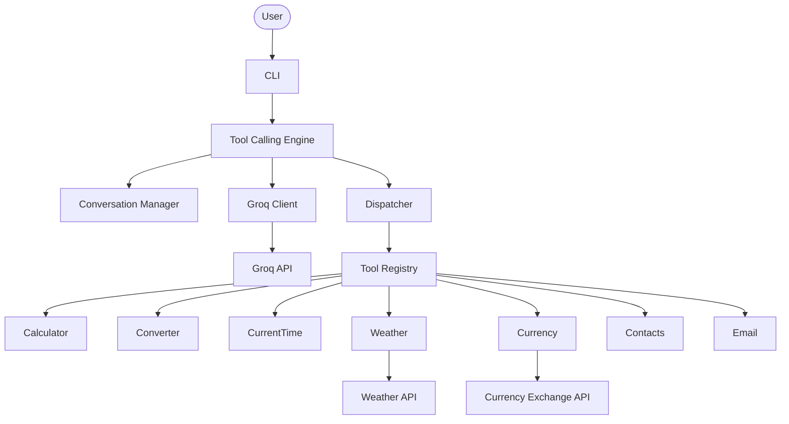

# AI Utility Assistant (CLI)

A terminal-based AI assistant built with **Python** and the **Groq API** that implements **manual LLM tool calling from first principles** without using orchestration frameworks such as LangChain or LangGraph.

---

# Project Overview

## What is this project?

This project demonstrates how an AI assistant can use external tools by manually implementing the complete tool-calling workflow.

Instead of relying on frameworks, every stage of the process is implemented from scratch, including:

- Conversation management
- Tool schema definition
- Tool selection
- Tool execution
- Tool result handling
- Multi-step tool orchestration

The primary objective is to understand **how LLM tool calling works internally** and why orchestration frameworks exist.

---

# How It Works

When a user submits a request, the assistant sends the conversation history and available tool schemas to the Groq LLM.

If the model decides a tool is required, it returns a structured tool call instead of a normal response.

The application then:

1. Identifies the requested tool.
2. Executes the corresponding Python function.
3. Appends the structured tool result to the conversation.
4. Sends the updated conversation back to the model.
5. Repeats this process until the model produces a final natural-language response.

This orchestration loop enables the assistant to perform multi-step reasoning while keeping each tool independent.

---

# Architecture



---

# Core Components

## Tool Calling Engine

Coordinates the complete tool-calling lifecycle.

Responsibilities:

- Send conversation history to the LLM
- Detect tool calls
- Execute requested tools
- Update conversation history
- Continue until a final response is generated

---

## Conversation Manager

Stores the conversation exchanged between the user, the LLM, and executed tools.

This allows the assistant to support clarification requests and sequential tool calls without maintaining a custom state machine.

---

## Dispatcher

Maps the tool name returned by the LLM to the corresponding Python function.

The engine never imports or calls individual tools directly.

---

## Tool Registry

Provides a single location where every available tool is registered.

Adding a new tool only requires:

- Implementing the tool
- Creating its schema
- Registering it

No changes are required in the engine.

---

## Tool Schemas

Each schema describes:

- Tool name
- Description
- Parameters
- Required arguments

The schemas are sent to the LLM so it knows which tools are available and how to call them.

---

# Available Tools

| Tool | Purpose |
|------|---------|
| Calculator | Performs arithmetic calculations. |
| Unit Converter | Converts supported measurement units. |
| Current Time | Returns the current local time. |
| Weather | Retrieves current weather information for a city. |
| Currency Converter | Converts between currencies using live exchange rates. |
| Contact Lookup | Searches the in-memory contact list. |
| Mock Email | Simulates sending an email using retrieved contact information. |

---

# Project Structure

```text
app.py                 # CLI entry point
config.py              # Configuration

client/
    groq_client.py     # Groq API communication

engine/
    engine.py          # Orchestration loop
    llm.py             # LLM interaction
    conversation.py    # Conversation management

dispatcher/
    dispatcher.py      # Dispatches tool calls

schemas/               # Tool schemas exposed to the LLM

tools/                 # Business logic for each tool
```

---

# Design Principles

- Tools perform only business logic.
- Tools always return structured data.
- The LLM generates all natural-language responses.
- The engine coordinates execution but contains no business logic.
- New tools can be added without modifying the engine.

---

# Future Improvements

- Automated testing
- Logging
- Persistent contacts database
- Real email integration
- Docker support
- Web interface
- LangChain implementation for comparison
